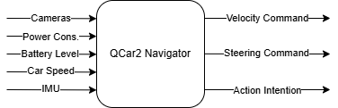
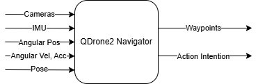
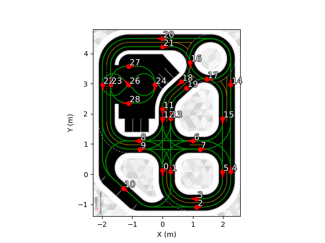
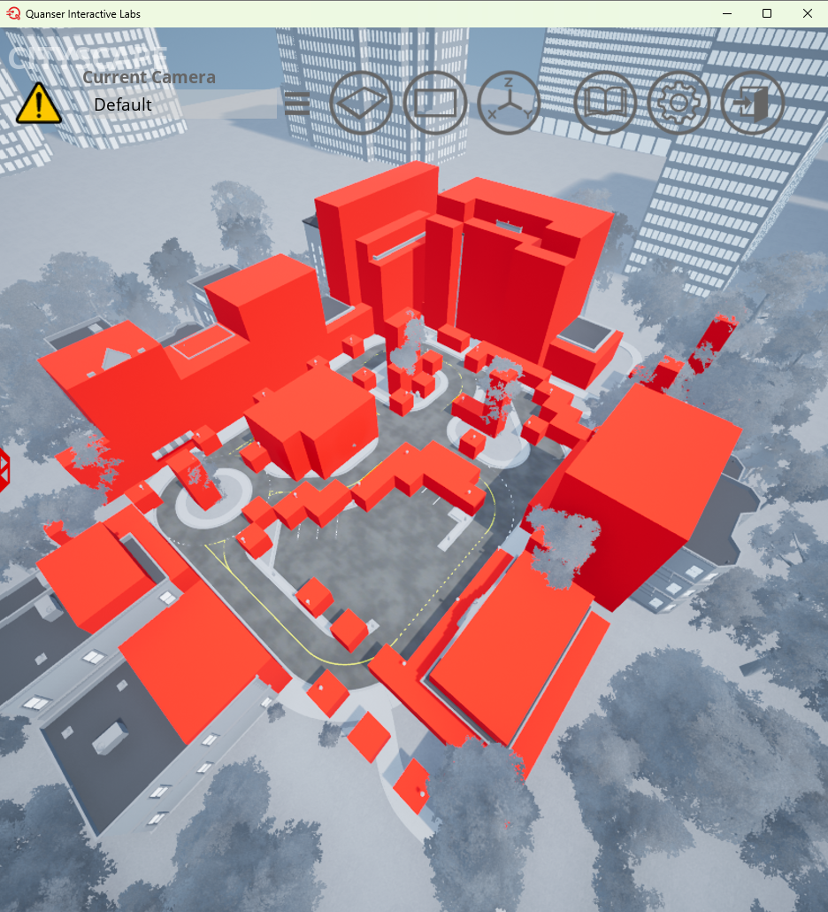
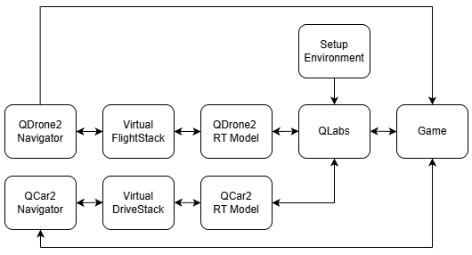

# Operational Guide

This guide explains the simulation environment, scenario rule implementation, and the development of a multimodal autonomous delivery solution within the simulation environment.

<!-- This guide explains how to run the SMC AICA 2026 Virtual Stage and defines the operational conditions that must be satisfied during execution. It combines system startup, navigator usage, pickup/drop/vehicle-to-vehicle package transfer behavior, runtime checks, communication channels, and mission constraints. -->

You can follow steps below for partcipating in this competition. 

1. [Preparation](#1-preparation): Complete system and software setup, open QLabs, and load the cityscape map. 
2. [Automated Startup](#2-automated-startup): As an initial exercise, pick up your first packages with QDrone2 and QCar2 using the example implementation in the SMC AICA 2026 Competition Files Package.
3. [Navigator Files](#3-navigator-files): Develop/modify QCar2 and QDrone2 navigator files to begin developing your own autonomous delivery solutions.
4. [For Advanced Development](#4-for-advanced-development): Understand the simulation environment details and modify the vehicle spawn locations.


## 1) Preparation

### System and Software Setup

Before running the system, make sure:

- all required software is installed,
- your system meets the competition hardware requirements,
- the required QLabs environment is available,
- all competition files are placed in the correct folder,
- the software setup steps have already been completed.

For setup details, see the [System and Software Setup](../03_Setup/System_and_Software_setup.md)

### Open QLabs and Load the Cityscape Map

1. Open Quanser Interactive Labs (QLabs) from the Windows Start menu, or go to `C:\Program Files\Quanser\Quanser Interactive Labs` and run the application.
2. Wait for QLabs to fully launch.
3. In QLabs, open Self-Driving Car Studio.
4. Select and load the Cityscape map.
5. Wait until the Cityscape environment finishes loading completely.
6. After the map is open, continue with `run_all.BAT` or `run_all.m` or run the required files manually.

---

## 2) Automated Startup

A batch file (`run_all.bat`) is provided to start the simulation for Python-based Navigator implementations, while a MATLAB script (`run_all.m`) is provided for Simulink-based Navigator implementations.

### Python Workflow

The batch file can be executed from a command window as follows:

Run:
`run_all.bat`

This script automatically:

- Runs the setup environment (`setup_env.py`)
- Starts the RT models (`Virtual_DriveStack.rt-win64`, `Virtual_FlightStack.rt-win64`)
- Starts the game (`game.py`)
- Launches the Python-based Navigators (`QCar2_Navigator.py`, `QDrone2_Navigator.py`)

To pick up the first packages:

- Type `task1` in QCar2_Navigator command window. It commands the QCar2 to drive to the Central Pickup location and pick up two small packages.
- Type `task1` in QDrone2_Navigator command window. It commands the QDrone2 to fly to the Central Pickup location and pick up one small package.

### MATLAB / Simulink Workflow

The MATLAB script can be executed from the MATLAB command window as follows:

Run:
`run_all.m`

This script automatically:

- Runs the setup environment (`setup_env.py`)
- Starts the RT models (`Virtual_DriveStack.rt-win64`, `Virtual_FlightStack.rt-win64`)
- Starts the game (`game.py`)
- Launches the Simulink-based Navigators (`QCar2_Navigator.slx`, `QDrone2_Navigator.slx`)

To pick up the first packages:

- Set Task_Constant to `1` in QCar2_Navigator Simulink screen. It commands the QCar2 to drive to the Central Pickup location and pick up two small packages.
- Set Task_Constant to `1` in QDrone2_Navigator Simulink screen. It commands the QDrone2 to fly to the Central Pickup location and pick up one small package.

---

## 3) Navigator Files

### 3.1 QCar2 Navigator

The QCar2 Navigator is the high-level controller responsible for decision-making and motion planning of the QCar2. Its inputs and outputs are illustrated in Figure 1.

<p align="center">
<figure class="navigator-figure">
  
  <figcaption><strong>Figure 1:</strong> QCar2 Navigator inputs and outputs</figcaption>
</figure>
</p>

To execute a delivery plan, the QCar2 Navigator must generate appropriate velocity and steering commands and publish the correct action intentions at each stage of the mission.

Velocity and steering commands can be generated by a low-level controller implementation or assigning a manual control keys. Sensor data can be used to support command generation and action intention decisions. The QCar2 Navigator has access to the following information:

- camera streams (disabled by default and enabled as needed in the provided code and model)
- sensor readings (Motor power consumption, battery level, car speed, IMU, pose [x, y, yaw])

### 3.2 QCar2 Communication Channels and Ports

QCar2 uses several fixed communication ports for:

- Read cameras, sensors, and sensor fusion outputs
- Send velocity and steering commands
- Send action intention

---

#### Ports to read cameras

If camera support is enabled in Python, the following ports are used:

| Camera | Address | Camera ID | Resolution |
|---|---|---|---|
| Right Camera | `tcpip://localhost:18961` | `0@tcpip://localhost:18961` | `640 x 480` |
| Back Camera | `tcpip://localhost:18962` | `1@tcpip://localhost:18962` | `640 x 480` |
| Front Camera | `tcpip://localhost:18963` | `2@tcpip://localhost:18963` | `640 x 480` |
| Left Camera | `tcpip://localhost:18964` | `3@tcpip://localhost:18964` | `640 x 480` |

> **Note:** All cameras operate at a frame rate of `30 fps` with a resolution of `640 x 480`.

---

#### Ports to read sensors and send velocity and steering commands

**QCar2 Data Stream**

| Parameter | Value |
|---|---|
| Address | `tcpip://localhost:18375` |
| Role| `Client` |
| Send Buffer Size | `1460` |
| Receive Buffer Shape | `(1, 10)` — `float64` |
| Receive Buffer Size | `1460` |

**Received Data Layout:**

| Index | Description | Unit |
|---|---|---|
| `[0]` | Motor power consumption | W |
| `[1]` | Battery level | % |
| `[2]` | Car speed | m/s |
| `[3:6]` | Gyroscope data | rad/s |
| `[6:9]` | Accelerometer data | m/s² |
| `[9]` | Connection status flag | — |

**Sent Data:** Velocity and steering commands as `[velocity, steering]` vector.

---

#### Port to read position and heading and to send action intention

| Parameter | Value |
|---|---|
| Address | `tcpip://localhost:19000` |
| Role | `Client` |
| Send Buffer Size | `8` |
| Receive Buffer Shape | `(1, 3)` — `float64` |
| Receive Buffer Size | `24` |

**Received Data:** Vehicle pose as `[x, y, yaw]`.

**Sent Data:** QCar2 intention value.

### 3.3 QDrone2 Navigator

The QDrone2 Navigator is the high-level controller responsible for decision-making and motion planning of the QDrone2. Its inputs and outputs are illustrated in Figure 2.

<p align="center">
<figure class="navigator-figure">
  
  <figcaption><strong>Figure 2:</strong> QDrone2 Navigator inputs and outputs</figcaption>
</figure>
</p>
To execute a delivery plan, the QDrone2 Navigator must generate appropriate waypoints and publish the correct action intentions at each stage of the mission.

Sensor data can be used to support waypoint generation and action intention decisions. The QDrone2 Navigator has access to the following information:

- camera streams (disabled by default and you can enable if needed)
- sensor readings (IMU, angular position, angular rates, angular acceleration, and pose)


### 3.4 QDrone2 Communication Channels and Ports

QDrone2 uses several fixed communication ports for:

- Read camera, sensors, and sensor fusion outputs
- Send waypoints
- Send action intention

---

#### Ports to Read Cameras


| Camera | Address | Camera ID | Resolution |
|---|---|---|---|
| RealSense RGB + Depth | `tcpip://localhost:18986` | `0@tcpip://localhost:18986` | `640 x 480` (RGB + Depth) |
| Right Camera | `tcpip://localhost:18982` | `0@tcpip://localhost:18982` | `640 x 480` |
| Back Camera | `tcpip://localhost:18983` | `1@tcpip://localhost:18983` | `640 x 480` |
| Left Camera | `tcpip://localhost:18984` | `2@tcpip://localhost:18984` | `640 x 480` |
| Downward Camera | `tcpip://localhost:18985` | `3@tcpip://localhost:18985` | `640 x 480` |

> **Note:** The RealSense camera operates in `RGB & DEPTH` mode and provides both RGB and Depth streams on the same port.

---

#### Port to read sensors and send waypoints

| Parameter | Value |
|---|---|
| Address | `tcpip://localhost:18373` |
| Role | `Client` |
| Send Buffer Size | `1460` |
| Receive Buffer Shape | `(1, 20)` — `float64` |
| Receive Buffer Size | `1460` |

**Received Data:** Sensor data as 

| Index | Description | Unit |
|---|---|---|
| `[0]` | Stream connection flag | — |
| `[1:4]` | IMU gyroscope data | rad/s |
| `[4:7]` | IMU accelerometer data | m/s² |
| `[7:10]` | Estimated angular position | rad |
| `[10:13]` | Estimated angular rates | rad/s |
| `[13:16]` | Estimated angular acceleration | rad/s² |
| `[16:20]` | Pose — x, y, z, yaw | m, m, m, rad |

**Sent Data:** Waypoint as `[x, y, z, yaw]` vector.

---

#### Port to send action intenion

| Parameter | Value |
|---|---|
| Address | `tcpip://127.0.0.1:19001` |
| Role | `Client` |
| Send Buffer Size | `8` |
| Receive Buffer Shape | `(1, 1)` — `float64` |
| Receive Buffer Size | `24` |

**Received Data:** None.

**Sent Data:** QDrone2 action intention value.

#### Performance Note

Commenting out unnecessary video subsystems can improve runtime performance and reduce computing resource requirements.

---

### 3.5 Example QCar2 Navigator

The example QCar2 Navigator demonstrates autonomous driving using a Stanley controller. It enables the QCar2 to travel from a specified start node to a target node on the road network while maintaining a desired velocity and publishing appropriate action intentions.

To support this implementation, several tools are provided. In particular, a list stores feasible routes between all pairs of nodes, as illustrated in Figures 3 and 4. The route corresponding to the selected start and target nodes is retrieved from this list and provided to the Stanley controller.

Using this route information, the controller computes the required steering and velocity commands, allowing the QCar2 to follow the path and reach the target node autonomously.


<p align="center">
  
</p>

<p align="center">
  <strong>Figure 3:</strong> QCar2 node numbering reference showing the Python mapping. The green trajectories show the routes. Central pickup is located at Node 24.
</p>

<p align="center">
  
</p>

<p align="center">
  <strong>Figure 4:</strong> QCar2 node numbering reference showing the MATLAB / Simulink mapping. The green trajectories show the routes. Central pickup is located at Node 25.
</p>


#### Tools to support Example Navigator

Sample tools are also provided in the `tools\QCar2_PathPlanning\` folder, including:


| File Type             | Python File     | MATLAB / Simulink Equivalent |
|----------------------|-----------------|------------------------------|
| Route List | `qcar2_paths.npy`|`qcar2_paths.mat`|
| Path Planning Script |`paths2pathposes.py`|`paths2pathposes.m`|
| Pose Route List | `qcar2_pathposes.npy`|`qcar2_pathposes.mat`|
| Roadmap Image | `roadmap.png`|`roadmap.png`|

- **Route List:** All routes shown in Figures 3 and 4 are saved in this file.
- **Path Planning Script:** It converts the routes (position) data into posed routes (position + heading) suitable for use with the Stanley controller. The converted routes are saved as `qcar2_pathposes.*` file (.npy for Python and .mat for MATLAB).
- **Roadmap Image:** This is Figures 3 and 4.

### 3.6 Example QDrone2 Navigator

The example QDrone2 Navigator generates waypoints from a start location to a target location while avoiding obstacles. To regulate the motion of the QDrone2, these waypoints are time-parameterized to produce smooth velocity profiles.

To support this implementation, several tools are provided. In particular, an occupancy list defines whether regions in the environment are free or occupied by obstacles or buildings. Based on this information, a voxel map is constructed, as shown in Figure 5. A path-planning algorithm is then applied to this voxel map to generate waypoints from the start location to the target location. Finally, a first-order interpolation with a ramp-type profiler is used to time-parameterize the generated waypoints.


<p align="center">
  
</p>

<p align="center">
  <strong>Figure 5:</strong> Voxel map of the Cityscape map.
</p>

#### Tools to support Example Navigator

Sample tools are also provided in the `tools\QDrone_PathPlanning\` folder, including:


| File Type             | Python File     | MATLAB / Simulink Equivalent |
|----------------------|-----------------|------------------------------|
| Occupancy Grid | `occupancy_grid.txt`|`occupancy_grid.txt`|
| Read Occupancy Grid| `read_occupancy_grid.py`|`read_occupancy_grid.m`|
| Graph| `city_voxel_map.npz`|`city_voxel_map.mat`|
| Path Planning Script |`plan_path.py`|`plan_path.m`|
| Profiler | `profile_ramp.py`|`profile_ramp.m`|
| Example | `example.py`|`example.m`|
| Plans | `qdrone2_plans.npz`|`qdrone2_plans.mat`|


- **Occupancy Grid:** This .txt file represents the city as a voxel map composed of 3 × 3 × 3 meter cubes. For each cube, the file specifies its location and whether it is occupied (1) or free space (0).
- **Read Occupancy Grid:** This script reads the .txt occupancy grid file and converts it into MATLAB- or Python-compatible matrices. It then saves the result as a graph representation in `city_voxel_map.*`.
- **Path Planning Script:** This script generates a waypoint path from a start location to an end location using Dijkstra’s algorithm on **city_voxel_map**.
- **Profiler:** This script time-parameterizes the waypoints generated by the Path Planning Script using a simple ramp profile.
- **Example:** This file demonstrates how to use the provided tools and saves the resulting plan as `qdrone2_plans.*`.

---


## 4) For Advanced Development

The scenario in the SMC AICA Challenge 2026 is simulated through the interaction of multiple application blocks operating together. These blocks and their interactions are illustrated in Figure 6.


<p align="center">
  
</p>

<p align="center">
<strong>Figure 6:</strong> System workflow block diagram for the SMC AICA 2026 Virtual Stage.
</p>

---

The roles of each application block are described below. Some application blocks may be modified, while others must not be modified.

- **Quanser Interactive Labs (QLabs)** application serves as the main simulation environment, where the required map is loaded, physical dynamics are simulated, and the scenario is visualized in 3D.
- The **Setup Environment** script (`setup_env.py`) is executed once at the start to spawn vehicles, pickup and delivery location pads at the QLabs, and to load the corresponding real-time (RT) models for each vehicle. This script **must not be modified**.
- Initial vehicle positions and headings are defined in the **Spawn Locations** (`spawn_locations.txt`), which **can be modified** to set custom spawn locations.

- The **QDrone2 RT Model** (`QDrone2_Open_Workspace.rt-win64`) simulates the QDrone2’s sensors and actuators. The contents of this component are inaccessible to competitors and **must not be modified**.
- The **Virtual FlightStack** (`virtual_FlightStack.rt-win64`) executes low-level control, sensor fusion, and core flight functionalities. The contents of this component are inaccessible to competitors and **must not be modified**.
- The **QDrone2 Navigator** acts as the high-level controller responsible for decision-making and motion planning of the QDrone2:
    - Sends waypoints to the Virtual FlightStack,
    - Receives vehicle sensor data and sensor fusion outputs from the Virtual FlightStack,
    - Sends action intentions to Game (`game.py`).

Competitors are required to develop the QDrone2 Navigator to generate appropriate waypoints and action intentions in accordance with the delivery strategy. Example implementations are provided in the Competition Files Package, including a Python version (`QDrone2_Navigator.py`) and a Simulink version (`QDrone2_Navigator.slx`).

- The **QCar2 RT Model** (`QCar2_Workspace.rt-win64`) simulates the QCar2’s sensors and actuators. The contents of this component are inaccessible to competitors and **must not be modified**.
- **Virtual DriveStack** (`virtual_DriveStack.rt-win64`) executes sensor fusion and core driving functionalities. The contents of this component are inaccessible to competitors and **must not be modified**.
- The **QCar2 Navigator** acts as the high-level controller responsible for decision-making and motion planning of the QCar2:
    - Sends velocity and steering commands to the Virtual DriveStack,
    - Receives vehicle sensor data and sensor fusion outputs from the Virtual DriveStack,
    - Sends action intentions to Game (`game.py`).

Competitors are required to develop the QDrone2 Navigator to generate velocity and steering commands and set action intentions in accordance with the delivery strategy. Since the Virtual DriveStack does not include low-level controllers, participants may implement their own low-level controller or use manual control inputs for velocity and steering commands to support development. Example implementations are provided in the SMC AICA 2026 Competition Files Package, including a Python version (`QCar2_Navigator.py`) and a Simulink version (`QCar2_Navigator.slx`).


- The Game (`game.py`) application block manages the scenario rules, handles pickup, vehicle-to-vehicle transfer, and drop-off operations, tracks scoring and mission time, and updates the score and mission time displayed in QLabs. This script **must not be modified**.

All components must run continuously until the mission is complete.


### File Structure

```text
9_SMC_AICA_2026_Competition_Files\
    setup_env.py                  
    QDrone2_Navigator.slx
    QDrone2_Navigator.py
    QCar2_Navigator.slx
    QCar2_Navigator.py
    run_all.bat
    run_all.m
    spawn_location.txt
    Virtual_DriveStack.rt-win64   
    Virtual_FlightStack.rt-win64  
    game.py
    tools\                       
        QDrone2_PathPlanning\
            city_voxel_map.npz
            occupancy_grid.txt
            plan_path.py
            profile_ramp.py
            qdrone2_plans.npz
            read_occupancy_grid.py
            example.py
        QCar2_PathPlanning\
            paths2pathposes.py
            qcar2_paths.npy
            qcar2_pathposes.npy
            roadmap.png
```

#### Back to:

[Virtual Stage Competition Guide](../01_Core_Guides/Virtual_Stage_Competiton_Guide.md)

[AICA Home Portal](../00_Portal/AICA_PORTAL.md)
