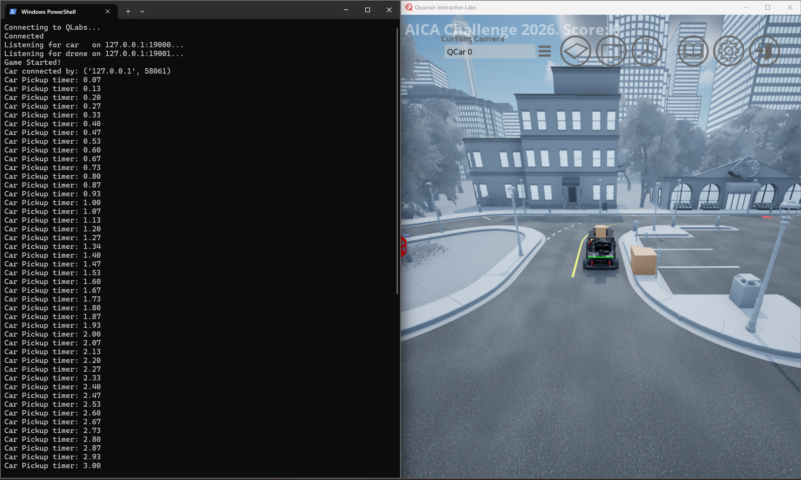
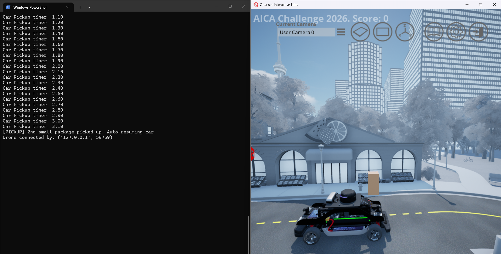
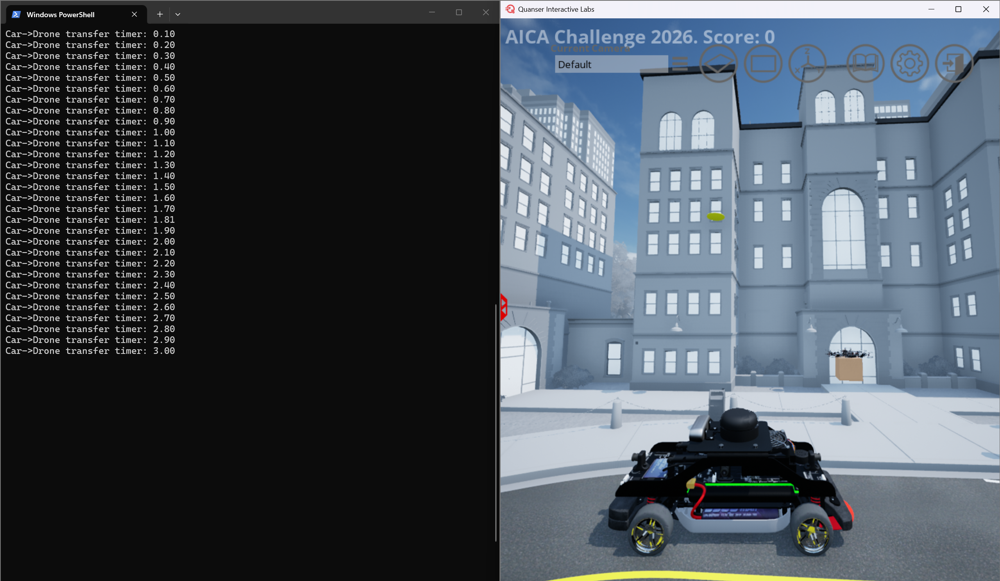
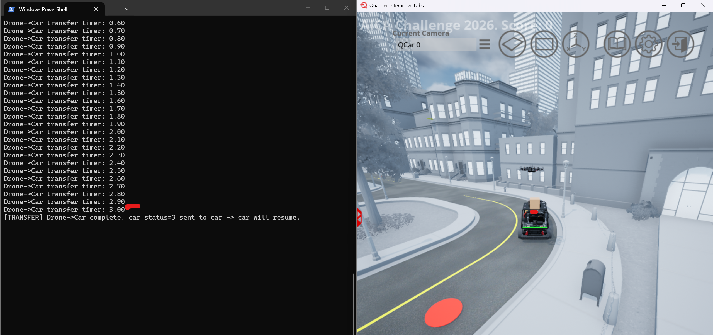
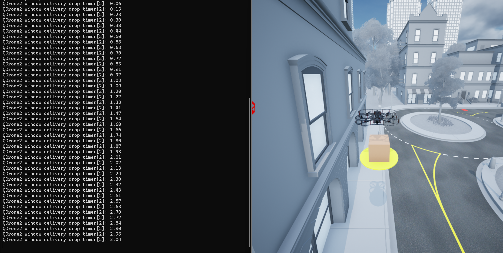
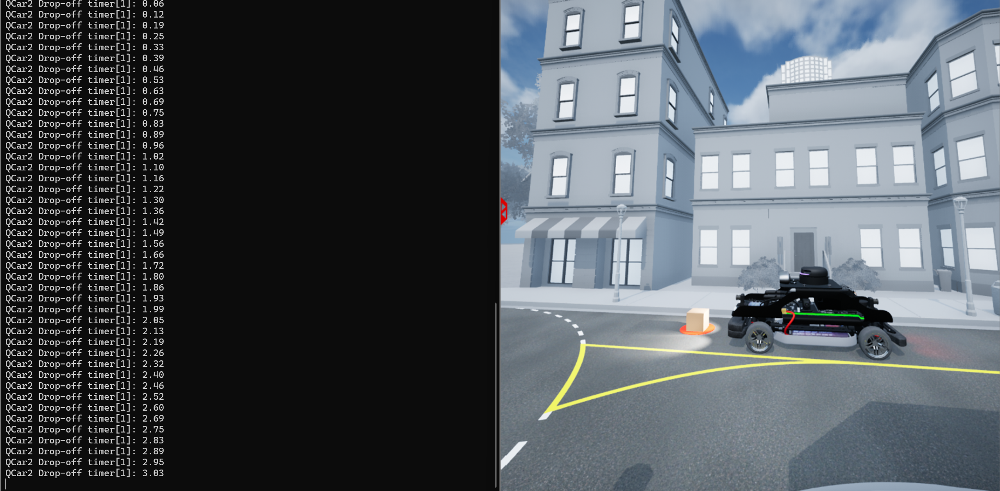

# Virtual Stage Detailed Scenario

This page describes the mission environment, delivery workflow, key location data, and strategy context for the AICA Virtual Stage.

---

## Navigation

- [Scenario Summary](#scenario-summary)
- [Mission Objective](#mission-objective)
  - [System Setup](#1-system-setup)
  - [Depot and Pickup Operations](#2-depot-and-pickup-operations)
  - [Vehicle-to-Vehicle Transfer](#3-vehicle-to-vehicle-transfer)
  - [Delivery Locations](#4-delivery-locations)
  - [Delivery Completion](#5-delivery-completion)
  - [Pick up and Delivery Location](#6-pick-up-and-delivery-location)

---

## Scenario Summary

- AICA Virtual Stage is a collaborative autonomy challenge where teams design and demonstrate an end-to-end delivery system using a ground vehicle (**QCar2**) and an aerial vehicle (**QDrone2**) operating in a shared mission environment.
- The scenario involves package pickup, vehicle-to-vehicle transfer, route execution, and final delivery using either window or common drop methods.
- Teams must coordinate both vehicles effectively while operating under timing constraints and predefined operational conditions.

---

## Mission Objective

- The objective is to complete all assigned deliveries in the minimum possible total mission time.
- Mission timing starts at the official scenario start and ends after all required deliveries are completed.
- Teams should optimize routing, coordination, delivery order, and delivery decisions while following operational constraints.
- Competitors are free to choose the order of deliveries, task allocation between QCar2 and QDrone2, and how they execute the mission strategy.

---

## 1) System Setup

Each team is provided with files to spawn:

- One **QCar2**
- One **QDrone2**

Both vehicles cooperate to transport delivery packages from the depot to designated apartment objectives.

### Vehicle Speed Limits

- **QCar2 max speed:** 13 m/s
- **QDrone2 max speed:** 2 m/s

Vehicles may operate below these limits, but must not exceed them.

### Initial Vehicle Locations

Initial spawn positions of QCar2 and QDrone2 can be adjusted by competitors by editing the `spawn_location.txt` file in the competition files folder. This file is used to control the starting position of the spawned vehicle(s) in QLabs.

---

## 2) Depot and Pickup Operations

At mission start:

- All packages are located at a central depot
- The depot contains **5 delivery packages**:
  - **4 small packages**
  - **1 large package**
- Both QCar2 and QDrone2 can pick up from the depot
  - **QCar2** can pick up small or large packages
  - **QDrone2** can only pick up small packages

### Pickup Condition

A pickup is successful when:

- **QCar2** remains within **2.0 m** of the pickup location for **3 seconds**
- **QDrone2** remains within **2.0 m** horizontal distance and within **0.0 m to 4.0 m** vertical offset of the pickup location for **3 seconds**

After the required hold time, the package is considered loaded.

#### Example Pickup from Depot will update with new depot location

### Carry Constraints

Current carry limits at a time are:

- **QCar2:** 2 small packages or 1 large package
- **QDrone2:** 1 small package

#### Example for Qcar2 with 2 packages

---

## 3) Vehicle-to-Vehicle Transfer

To enable collaborative autonomy, transfer is allowed in both directions:

- **QCar2 → QDrone2**
- **QDrone2 → QCar2**

### Transfer Condition

A transfer is successful when:

1. **QCar2** is stationary
2. **QDrone2** is within **2.0 m** horizontal distance of QCar2
3. **QDrone2** remains within **0.0 m to 4.0 m** vertical offset relative to QCar2
4. The required transfer condition is maintained for **3 seconds**

After this, package ownership transfers to the receiving vehicle.

#### Example Transfer

**QCar2 → QDrone2**

**QDrone2 → QCar2**

---

## 4) Delivery Locations

Each delivery objective (apartment) has two delivery options.

### A) Apartment Window (Drone Only)

- Delivery is performed directly to the apartment window
- Only **QDrone2** can perform window delivery
- This is the faster and higher-value delivery mode

### B) Common Drop Location

- A shared drop point is provided for each apartment building
- **QCar2** or **QDrone2** can deliver to this location
- This is more flexible, but may be less favorable for scoring depending on the scenario configuration

### Floor Drop-Off (Window Delivery) v/s Common Drop-Off

- Delivery locations may include both **floor drop-off** targets and **common drop-off** locations.
- **Floor drop-off** deliveries can receive different score bonuses depending on the floor level.
- **Common drop-off** deliveries follow the standard scoring method without floor-based bonus.
- Teams should consider both the delivery type and the scoring difference when planning delivery order and strategy.

---

## 5) Delivery Completion

A delivery is considered complete only after the package is successfully dropped at the designated drop-off location according to the scenario logic.

### Window Delivery (Drone)

- The drone must remain within **2.0 m** horizontal distance and within **0.0 m to 4.0 m** vertical offset of the window delivery target for at least **3 seconds**

#### Example Window Delivery

### Common Drop Delivery (Car or Drone)

- **QCar2:** Must remain within **2.0 m** of the drop location for at least **3 seconds**
- **QDrone2:** Must remain within **2.0 m** horizontal distance and within **0.0 m to 4.0 m** vertical offset of the drop location for at least **3 seconds**

#### Example Common Delivery by Car

---

## 6) Pick up and Delivery Location

- Pickup Depot: **P**
- Small package delivery locations: **D1, D2, D3, D4**
- Large package delivery location: **D5**

### Important Note

Node numbering is different between **Python** and **MATLAB / Simulink** for QCar2.

- **QCar2** uses node numbers and location coordinates
- **QDrone2** uses location coordinates only
- Use the **QCar2 table** for pickup and drop node selection in car routing
- Use the **QDrone2 table** for pickup, drop, and window delivery target coordinates

### QCar2 Pickup and Delivery Reference

| Location | Package Type | Python Node | MATLAB / Simulink Node | Ground Location `[x y]` |
|---|---|---:|---:|---|
| Pickup Depot (P) | Pickup | 24 | 25 | `[-2.50305 29.6703]` |
| Drop Location 1 (D1) | Small | 2 | 3 | `[11.2739 -10.84655]` |
| Drop Location 2 (D2) | Small | 14 | 15 | `[22.5478 29.6703]` |
| Drop Location 3 (D3) | Small | 20 | 21 | `[0.0 44.9735]` |
| Drop Location 4 (D4) | Small | 22 | 23 | `[-19.84125 29.6703]` |
| Drop Location 5 (D5) | Large | 10 | 11 | `[-12.8205 -4.5991]` |

### QDrone2 Pickup and Delivery Reference

| Location | Package Type | Ground Location `[x y z]` | Floor | Window Location `[x y z]` |
|---|---|---|---:|---|
| Pickup Depot (P) | Pickup | `[-2.50305 29.6703 0.05]` | - | None |
| Drop Location 1 (D1) | Small | `[11.2739 -10.84655 0.05]` | 4 | `[15.1739 -18.04655 9.65]` |
| Drop Location 2 (D2) | Small | `[22.5478 29.6703 0.05]` | 3 | `[26.0478 16.7703 9.65]` |
| Drop Location 3 (D3) | Small | `[0.0 44.9735 0.05]` | 2 | `[1.3 46.9735 4.85]` |
| Drop Location 4 (D4) | Small | `[-19.84125 29.6703 0.05]` | 1 | None |
| Drop Location 5 (D5) | Large | `[-12.8205 -4.5991 0.05]` | 1 | None |

### Strategy Note

Teams are free to choose delivery order, task allocation, and delivery method based on their own mission strategy.

---

Back to:

[Virtual Stage Competition Guide](../01_Core_Guides/Virtual_Stage_Competiton_Guide.md)

[AICA Home Portal](../00_Portal/AICA_PORTAL.md)
