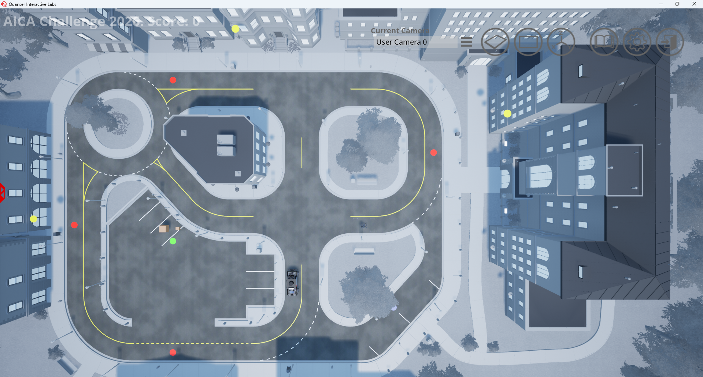

# Virtual Stage Detailed Scenario

This page provides details of the virtual stage scenario that simulates a multimodal autonomous delivery system in an urban environment.

---

## Navigation

- [Scenario Summary](#scenario-summary)
    - [System Setup](#1-system-setup)
    - [Central Pickup Operations](#2-central-pickup-operations)
    - [Vehicle-to-Vehicle Package Transfer](#3-vehicle-to-vehicle-package-transfer)
    - [Delivery Options](#4-delivery-options)
    - [Pick up and Delivery Locations](#5-pick-up-and-delivery-locations)

---

## Scenario Summary

- AICA Challenge Virtual Stage is a collaborative autonomy challenge where teams design, implement, and demonstrate a multimodal autonomous delivery system using a QCar2 and a QDrone2 operating in a shared mission environment.
- The scenario focuses on demonstrating the ability to perform multimodal delivery through package pickup, navigation, and final delivery using either window delivery or shared drop-off methods.
- Vehicle-to-vehicle package transfer is supported as an optional coordination feature and may be used if it benefits the team’s delivery strategy.

*Figure: The image presents an overview of the scenario, while the details are described in the following sections.*

### 

---

## 1) System Setup

In the virtual stage scenario, one QCar2 and one QDrone2 operate cooperatively to perform deliveries within the city.

The QCar2 can pick up packages from the central pickup location, deliver them to shared drop-off locations, and transfer packages to and from the QDrone2.

Similarly, the QDrone2 can pick up packages from the central pickup location, deliver them to shared drop-off or window delivery locations, and transfer packages to and from the QCar2.

---

## 2) Central Pickup Operations

At mission start:

- All packages are located at the central pickup location,
- There are 5 delivery tasks: 4 small-package deliveries and 1 large-package delivery,
- The QCar2 can pick up both small and large packages,
- The QDrone2 can only pick up small packages,
- The central pickup location is indicated by the green pad in QLabs screen.

### Carry Constraints

Current carry limits at a time are:

- **QCar2:** 2 small packages or 1 large package
- **QDrone2:** 1 small package

#### Example for Qcar2 with 2 packages

---

## 3) Vehicle-to-Vehicle Package Transfer

To enable collaborative autonomy, vehicle-to-vehicle package transfer is allowed in both directions:

- QCar2 → QDrone2
- QDrone2 → QCar2

#### Example Vehicle-to-Vehicle Package Transfer

QCar2 → QDrone2

QDrone2 → QCar2

---

## 4) Delivery Options

Each delivery has two options.

### A) Window Delivery (QDrone2 Only)

- Delivery is performed directly to the apartment window.
- This delivery mode provides bonus points.
- Window delivery locations are indicated by yellow pads.

### B) Shared Drop-Off Location

- A Shared Drop-Off point is provided for each apartment building.
- QCar2 or QDrone2 can deliver to this location.
- Shared drop-off locations are indicated by red pads for small-package deliveries and a blue pad for the large-package delivery.

---

## 5) Pick up and Delivery Locations

- Central pickup: *(Green Pad)* P
- Small package delivery locations: *(Red Pad)* D1, D2, D3, D4
- Large package delivery location: *(Blue Pad)* D5

### Note

- QCar2 uses node numbers for route planning and location coordinates for control.
- QCar2 node numbering is different in Python and MATLAB / Simulink: Python starts from 0, while MATLAB / Simulink starts from 1.
- The QDrone2 uses location coordinates for both path planning and control.

*Figure: QCar2 node numbering reference showing the Python mapping*

---

*Figure: QCar2 node numbering reference showing the MATLAB / Simulink mapping*

### QCar2 Pickup and Delivery Reference

| Location | Package Type | Python Node | MATLAB / Simulink Node | Shared Drop-Off Location `[x y]` |
|---|---|---:|---:|---|
| Central pickup (P) | Pickup | 24 | 25 | `[-2.50305 29.6703]` |
| Drop Location 1 (D1) | Small | 2 | 3 | `[11.2739 -10.84655]` |
| Drop Location 2 (D2) | Small | 14 | 15 | `[22.5478 29.6703]` |
| Drop Location 3 (D3) | Small | 20 | 21 | `[0.0 44.9735]` |
| Drop Location 4 (D4) | Small | 22 | 23 | `[-19.84125 29.6703]` |
| Drop Location 5 (D5) | Large | 10 | 11 | `[-12.8205 -4.5991]` |

### QDrone2 Pickup and Delivery Reference

| Location | Package Type | Shared Drop-Off Location `[x y z]` | Floor | Window Delivery Location `[x y z]` |
|---|---|---|---:|---|
| Central pickup (P) | Pickup | `[-2.50305 29.6703 0.05]` | - | None |
| Drop Location 1 (D1) | Small | `[11.2739 -10.84655 0.05]` | 4 | `[15.1739 -18.04655 9.65]` |
| Drop Location 2 (D2) | Small | `[22.5478 29.6703 0.05]` | 3 | `[26.0478 16.7703 9.65]` |
| Drop Location 3 (D3) | Small | `[0.0 44.9735 0.05]` | 2 | `[1.3 46.9735 4.85]` |
| Drop Location 4 (D4) | Small | `[-19.84125 29.6703 0.05]` | 1 | None |
| Drop Location 5 (D5) | Large | `[-12.8205 -4.5991 0.05]` | 1 | None |

### Strategy Note

Teams are free to choose delivery order, task allocation, and delivery method based on their own mission strategy.

---

Back to:

[Virtual Stage Competition Guide](../01_Core_Guides/Virtual_Stage_Competiton_Guide.md)

[AICA Home Portal](../00_Portal/AICA_PORTAL.md)
