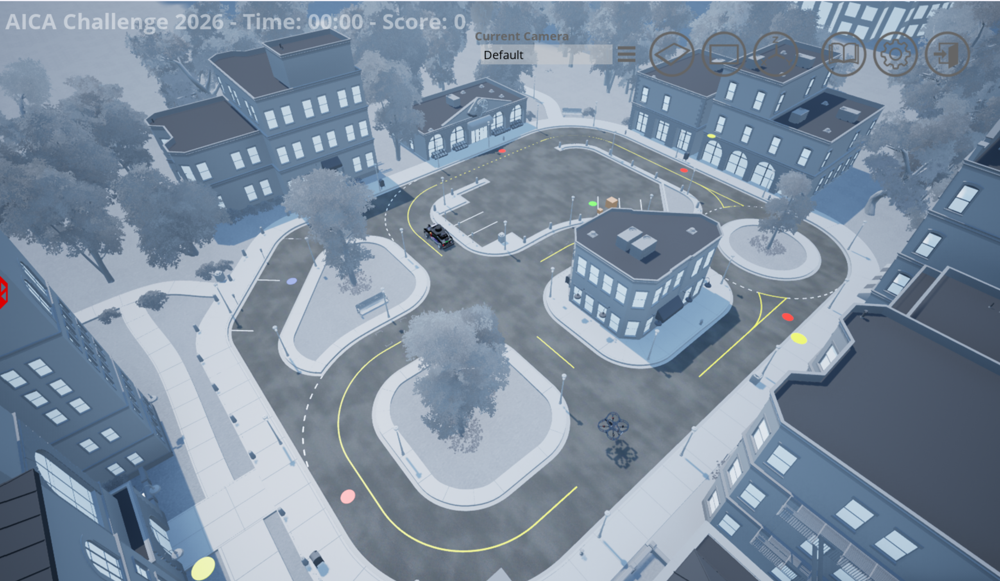
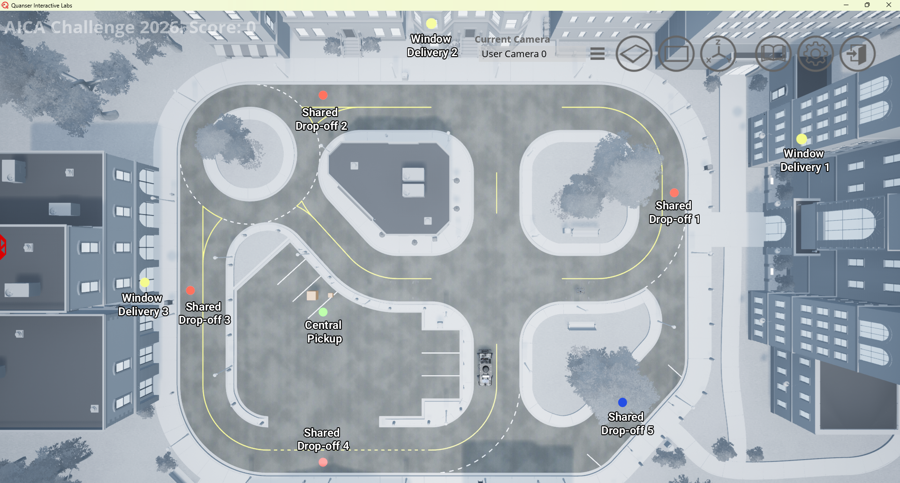

# Virtual Stage Detailed Scenario

This page provides details of the virtual stage scenario that simulates a multimodal autonomous delivery system in an urban environment.

---

## Navigation

- [Scenario Summary](#scenario-summary)
- [Scenario Setup](#scenario-setup)
- [Pickup and Delivery Locations](#pickup-and-delivery-locations)
- [Scenario Rules](#scenario-rules)

---

## Scenario Summary

Urban logistics is undergoing a rapid transformation, driven by the rise of e-commerce and increasing expectations for fast and reliable deliveries. In dense urban environments, ensuring timely delivery, especially for safety-critical items, remains a significant challenge. To address these demands, cities are exploring innovative multimodal autonomous delivery systems that leverage the complementary strengths of different vehicle types.

The IEEE SMC AICA Challenge 2026 brings this vision to life through a realistic urban scenario, where a QCar2 and a QDrone2 cooperate to deliver packages from a central pickup location to customers. Deliveries can be completed in two ways: 

- Dropped off at a shared building location by either vehicle.
- Delivered directly to a customer’s window by the QDrone2, which is valuable for customers on higher floors, especially elderly individuals or people with limited mobility.

Customer satisfaction is reflected through a scoring system that considers both delivery time and delivery type, with higher rewards for faster service and window deliveries, especially for high-rise locations.

Each vehicle offers distinct advantages and limitations:

- The QCar2 is faster and can carry heavier loads but is restricted to road networks and shared drop-off locations
- The QDrone2 offers greater mobility and can access vertical spaces for window deliveries, but operates at lower speeds with limited payload capacity

To enhance cooperation, vehicle-to-vehicle package transfer is also available as an operational option. To maximize customer satisfaction, participants must design strategies that effectively coordinate both vehicles. This includes making decisions such as:

- Selecting shared drop-off or window delivery for each task
- Assigning pickup, vehicle-to-vehicle transfer, and drop-off responsibilities between vehicles
- Determining service order and grouping of deliveries

Success in this challenge requires developing effective delivery strategies and implementing efficient path-planning and control algorithms.

### 

<strong>Figure 1:</strong> Overview of cityscape scenario map

---

## Scenario Setup

### Delivery Information

- The scenario includes 5 delivery tasks: 4 small-package deliveries and 1 large-package delivery.
- All packages are initially located at the central pickup location. 
- Two delivery options are available: shared drop-off and window delivery.

#### Shared Drop-Off

- Shared drop-off refers to delivering packages to the designated drop-off location in front of each apartment building.
- This delivery option is available for all packages.
- Both the QCar2 and the QDrone2 can perform shared drop-off deliveries.
- Shared drop-off locations are indicated by red pads for small-package deliveries and a blue pad for the large-package delivery in the cityscape map.

#### Window Delivery

- Window delivery refers to delivering packages directly to the apartment window.
- This option is available only for selected deliveries.
- Only the QDrone2 can perform window deliveries.
- Window delivery locations are indicated by yellow pads in the cityscape map.
- This delivery mode provides bonus points, with the score determined by the customer’s floor level.

### Vehicle Information

One QCar2 and one QDrone2 operate cooperatively to complete deliveries.

The QCar2 can perform five different actions:

- Pick up a small package from the central pickup location
- Pick up a large package from the central pickup location
- Drop off packages at shared drop-off locations
- Receive a small package from the QDrone2 (QDrone2-to-QCar2 package transfer)
- Transfer a small package to the QDrone2  (QCar2-to-QDrone2 package transfer)

QDrone2 can four different actions:

- Pick up a small package from the central pickup location
- Drop off packages at shared drop-off locations or at window delivery locations
- Receive a small package from the QCar2 (QCar2-to-QDrone2 package transfer)
- Transfer a small package to the QCar2  (QDrone2-to-QCar2 package transfer)

Both vehicles have limited payload capacity:

- QCar2 can carry either 2 small packages or 1 large package at a time
- QDrone2 can carry 1 small package at a time
---

## Pickup and Delivery Locations

<strong>Figure 2:</strong> Central pickup and delivery locations for the 5 packages.

Table 1 lists the pickup and delivery locations. Any location within the city is represented using coordinates, expressed as a 3-dimensional vector.
In addition, specific locations in the road network are represented as nodes indexed by integers. Node numbering differs between Python and MATLAB/Simulink: Python uses zero-based indexing as shown in Figure 3, whereas MATLAB/Simulink uses one-based indexing as shown in Figure 4.

<strong>Table 1:</strong> Central pickup and delivery location coordinates and nodes for the 5 packages.

### Pickup and Delivery Table

| Location | Package Type | Shared Drop-Off   Location `[x y z]` | Shared Drop-off   Python Node | Shared Drop-off   Matlab Node | Floor | Window Delivery   Location `[x y z]` |
|---|---|---|---:|---:|---:|---|
| Central pickup | Pickup | [-2.50305 29.6703 0.05] | 24 | 25 | - | None |
| Delivery 1 | Small | [11.2739 -10.84655 0.05] | 2 | 3 | 4 | [15.1739 -18.04655 9.65] |
| Delivery 2 | Small | [22.5478 29.6703 0.05] | 14 | 15 | 3 | [26.0478 16.7703 9.65] |
| Delivery 3 | Small | [0.0 44.9735 0.05] | 20 | 21 | 2 | [1.3 46.9735 4.85] |
| Delivery 4 | Small | [-19.84125 29.6703 0.05] | 22 | 23 | 1 | None |
| Delivery 5 | Large | [-12.8205 -4.5991 0.05] | 10 | 11 | 1 | None |

---

<strong>Figure 3:</strong> Road network with node numbering in Python.

---

<strong>Figure 4:</strong> Road network with node numbering in MATLAB/Simulink.

---

## Scenario Rules

The scenario rules regulates pickup, vehicle-to-vehicle package transfer, and drop-off operations. Action intention is the integer representation of the action that a vehicle plans to perform.

QCar2 Intention List:

    0: Nothing

    1: Pickup Small

    2: Pickup Large

    3: Drop-off

    4: Transfer from QDrone2

    5: Transfer to QDrone2

QDrone2 Action Intention List:

    0: Nothing

    1: Pickup Small

    2: Drop-off

    3: Transfer from QCar2

    4: Transfer to QCar2

- The QDrone2 picks up a small package after setting its action intention to 1 and maintaining, for at least 3 seconds, a horizontal distance of 2.0 m or less and a vertical distance between 0.0 m and 4.0 m relative to the central pickup location.

- The QDrone2 drops off a small package after setting its action intention to 2 and maintaining, for at least 3 seconds, a horizontal distance of 2.0 m or less and a vertical distance between 0.0 m and 4.0 m relative to a shared drop-off or a window delivery location.

  

  <strong>Figure 5:</strong> QDrone2 window delivery

- The QCar2 transfers a small package to QDrone2 when QDrone2 sets its action intention to 3 and QCar2 sets its action intention to 5. In addition, they must maintain, for at least 3 seconds, a horizontal distance of 2.0 m or less and a vertical distance between 0.0 m and 4.0 m relative to each other.

- The Drone2 transfers a small package to QCar2 when QDrone2 sets its action intention to 4 and QCar2 sets its action intention to 4. In addition, they must maintain, for at least 3 seconds, a horizontal distance of 2.0 m or less and a vertical distance between 0.0 m and 4.0 m relative to each other.

- The QCar2 picks up a small package after setting its action intention to 1 and maintaining, for at least 3 seconds, a horizontal distance of 2.0 m or less relative to the central pickup location.

- The QCar2 picks up a large package after setting its action intention to 2 and maintaining, for at least 3 seconds, a horizontal distance of 2.0 m or less relative to the central pickup location.

- The QCar2 drops off a small or large package after setting its action intention to 3 and maintaining, for at least 3 seconds, a horizontal distance of 2.0 m or less relative to a shared drop-off location.

  

  <strong>Figure 6:</strong> QCar2 shared drop-off delivery

Back to:

[Virtual Stage Competition Guide](../01_Core_Guides/Virtual_Stage_Competiton_Guide.md)

[AICA Home Portal](../00_Portal/AICA_PORTAL.md)
