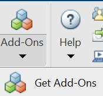
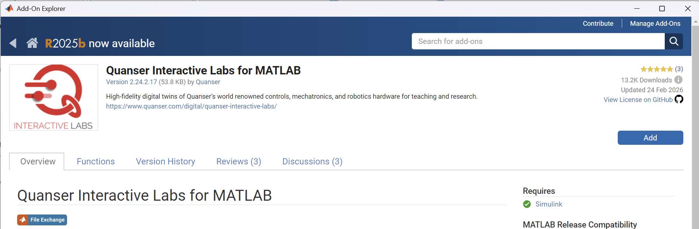
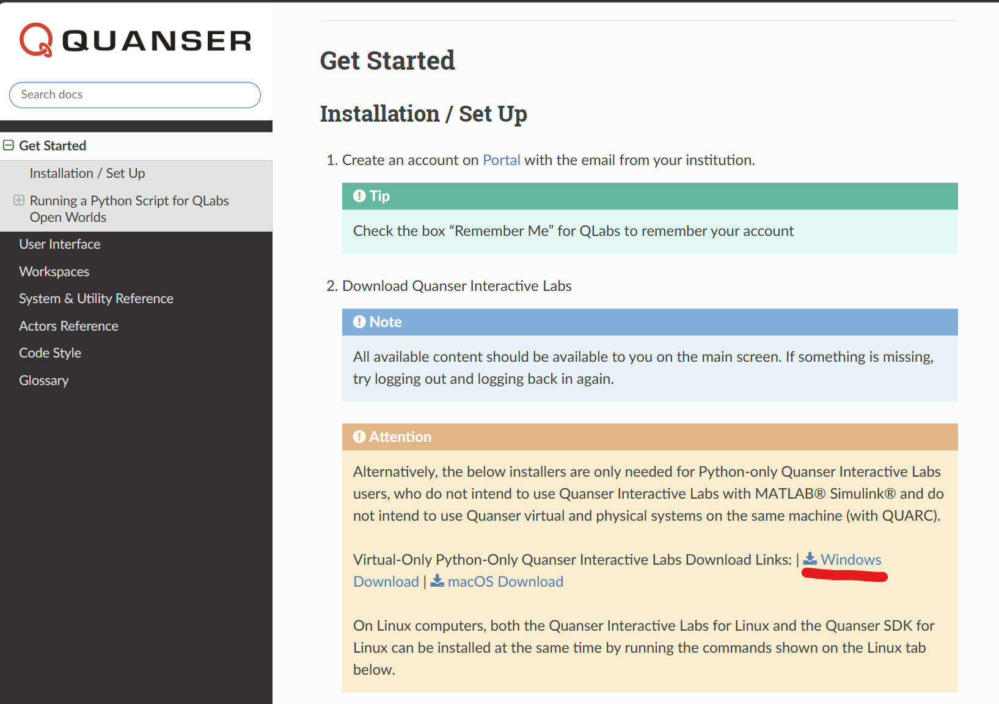
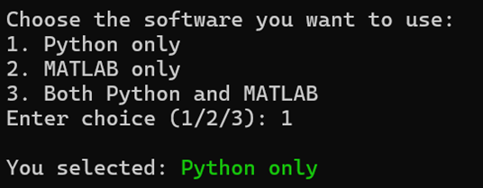
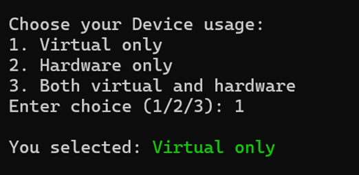
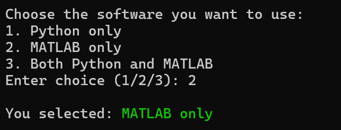
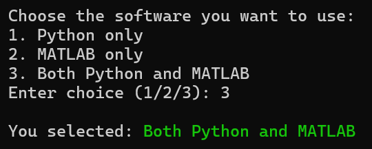

# Software Setup & Installation

This page provides the software setup and installation steps required before running the IEEE SMC AICA 2026 competition files.

If you are using both **MATLAB / Simulink** and **Python**, follow both sections below.  
If you are using only one workflow, follow the corresponding section only.


---

## Step 1 -- Initial Download 

Before software installation, 
On your system, create a folder called _Quanser_ under _Documents_. This should look like `C:/Users/user/Documents/Quanser`. download the documentation and competition runtime files into your local `Documents/Quanser` workspace.

---

### 1A) Download Competition Files 

A separate folder for actual competition files.

#### With Git

1. Install [Git](https://git-scm.com/downloads).
2. Open a terminal in `C:\Users\<YourUsername>\Documents\Quanser\`.
3. Clone the repository: [IEEE SMC AICA Competition 2026](https://github.com/UTADNCLab/IEEE-SMC-AICA-Competition-2026.git)

#### Without Git (ZIP)

1. Open the repository on GitHub.
2. Click **Code -> Download ZIP**.
3. Extract the ZIP and place it at:

```text
C:\Users\<YourUsername>\Documents\Quanser
```

---

### 1B) Expected Local Layout

```text
C:\Users\<YourUsername>\Documents\Quanser\
    0_libraries, 1_setup ..\
    9_AICA_Competition_Files\
```

For detailed installation guide for Quanser resources, see the [Quanser_Academic_Resources](https://github.com/quanser/Quanser_Academic_Resources)

---

## Step 2 -- Install Required Software

### MATLAB (2023a or later)

- Download: [MATLAB for Windows](https://www.mathworks.com/downloads/)
- In MATLAB, install **Quanser Interactive Labs for MATLAB** via Add-On Explorer.






### C Compiler (required for Simulink workflows)

- Download: [Visual Studio Community](https://visualstudio.microsoft.com/thank-you-downloading-visual-studio/?sku=Community&channel=Stable&version=VS18&source=VSLandingPage&cid=2500&passive=false)

### Python (3.12 recommended)

- Download from: [Python Official Downloads](https://www.python.org/downloads/)
> WARNING
> ⚠️❗**Make sure to click on  the _Add Python to PATH_ option in the first screen of the installer**.

> **NOTE:**
> **IF YOU DOWNLOAD FROM THE PYTHON WEBSITE, DO NOT USE THE PYTHON INSTALL MANAGER**  

### Quanser Interactive Labs (QLabs)

- Install via MATLAB Add-On Explorer (MATLAB workflow), or
- Install standalone: [QLabs Getting Started](https://qlabs.quanserdocs.com/en/latest/Get%20Started.html)




### **Note:** If you are using both MATLAB / Simulink and Python, QLabs only needs to be installed once using either of the methods above.

---

## Step 3 -- Check System Requirements

Navigate to:

```text
C:\Users\<YourUsername>\Documents\Quanser\5_research\1_setup\
```

Run `step_1_check_requirements` and select your mode:

|Selection| Software you want to use |Device Usuage |
|-----|------|-----------|
|When only using Python| Python Only (Option 1) |  Virtual Only (Option 1) |
|When only using MATLAB| MATLAB Only (Option 2) |  Virtual Only (Option 1) |
|When using both | Both Python + MATLAB (Option 3)| Virtual Only (Option 1)|


| Workflow | Software Selection | Device Usage Selection |
|---|---|---|
| Python Only |  |  |
| MATLAB Only |  |  |
| Python + MATLAB |    |  |

A **green highlighted box** indicates successful configuration and required dependencies are available.

In a successful setup check:

- the required dependencies are detected correctly
- installed software versions are shown
- the system diagnosis completes without missing required tools

---

## Step 4 -- Configure Environment

From `1_setup`, run:

```bat
configure_python.bat
configure_matlab.bat
```

- Run `configure_python.bat` for Python workflow only
- Run `configure_matlab.bat` for MATLAB workflow only

- Run both files when using both Python + MATLAB

> Restart your system after running setup scripts before continuing.

---

### Back to [ AICA Portal](../00_Portal/AICA_PORTAL.md)


